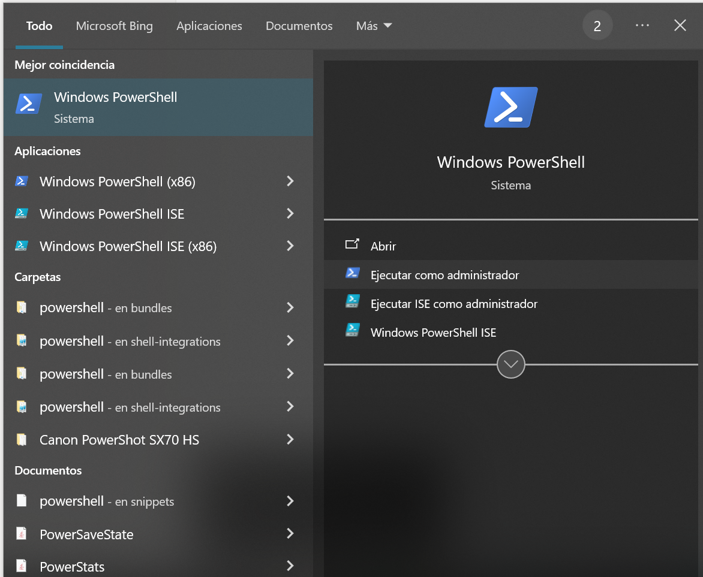

# Guía Instalación mysql en wsl

# 🖥️ PASO 1 — Instalar WSL en Windows

🔹 Esto se hace **una sola vez** y te permite tener Linux dentro de tu Windows.

---

## 🅐 Abrir PowerShell como administrador

1. Haz clic en el botón de **Inicio**
2. Escribe `PowerShell`
3. Haz **clic derecho** en “Windows PowerShell” → **“Ejecutar como administrador”**



---

## 🅑 Instalar WSL con Ubuntu

En esa ventana azul que aparece (PowerShell), copia y pega este comando y pulsa **Enter**:

```powershell
wsl --install -d Ubuntu
```

Esto hará varias cosas automáticamente:

- Activa la función WSL en Windows
- Descarga e instala Ubuntu (una versión de Linux)
- Puede tardar unos minutos

Cuando termine, te pedirá **reiniciar el ordenador** → hazlo.

---

## 🅒 Crear tu usuario de Linux

Cuando vuelvas a entrar en Windows, se abrirá **automáticamente una ventana de Ubuntu (negra)**.

Ahí te pedirá:

- Nombre de usuario de Linux → escribe lo que quieras (ej: `profesor`) y pulsa Enter
- Contraseña → escribe algo sencillo (ej: `1234`) y pulsa Enter

> ⚠️ Al escribir la contraseña no se ven las letras, es normal. Simplemente escribe y pulsa Enter.
> 

¡Listo! Ya tienes Linux funcionando dentro de Windows 🎉

---

# 🐧 PASO 2 — Instalar MySQL en tu Linux (WSL)

Ahora ya estás en la ventana negra de Ubuntu (la terminal).

Copia y pega estos comandos **uno a uno** (pulsa Enter después de cada uno):

```bash
sudo apt update
```

> Esto actualizará la lista de programas. Te pedirá tu contraseña de Linux (la que pusiste antes).
> 

Luego:

```bash
sudo apt upgrade -y
```

> Esto actualiza los programas que ya tienes.
> 

Ahora instala MySQL:

```bash
sudo apt install -y mysql-server mysql-client
```

Cuando acabe, inicia MySQL:

```bash
sudo service mysql start
```

✅ Ya tienes MySQL instalado y funcionando 🎉

---

# 🛠️ PASO 3 — Crear un usuario `admin` con contraseña `1234`

Ahora vamos a crear un usuario para que puedas entrar sin usar `sudo`.

1. Entra en MySQL como `root` (el administrador interno):

```bash
sudo mysql
```

1. Ahora verás el prompt `mysql>`
    
    Copia y pega estas líneas completas y pulsa Enter:
    

```sql
CREATE USER IF NOT EXISTS 'admin'@'localhost' IDENTIFIED BY '1234';
GRANT ALL PRIVILEGES ON *.* TO 'admin'@'localhost' WITH GRANT OPTION;
FLUSH PRIVILEGES;
EXIT;
```

---

# 🧪 PASO 4 — Probar que todo funciona

Ahora entra con el usuario que acabas de crear:

```bash
mysql -u admin -p
```

Escribe `1234` cuando lo pida.

Deberías ver algo como:

```
mysql>
```

Eso significa que ¡ya estás dentro de tu base de datos MySQL! 🎉

Prueba estos comandos:

```sql
SHOW DATABASES;
```

y

```sql
EXIT;
```

**Si te da este error:** 


Ejecuta estos comandos:

```jsx
sudo mkdir -p /var/run/mysqld
sudo chown mysql:mysql /var/run/mysqld
sudo chmod 755 /var/run/mysqld
sudo service mysql restart
```

---

# 💡 PASO 5 — Qué hacer a partir de ahora

Cada vez que quieras usar MySQL:

1. Abre el **menú Inicio**
2. Escribe **Ubuntu** y ábrelo (es la terminal de Linux)
3. Arranca el servidor MySQL (si no se hace por defecto)

```bash
sudo service mysql start
```

1. Entra a tu base de datos:

```bash
mysql -u admin -p
```

(escribe `1234`)

---
# PASO 6 - Git

Esto solo se hace una vez en cada ordenador
```bash
cd
git clone https://github.com/Dpto-Informatica-IES-Francisco-de-Goya/BasesDeDatos.git
```

Cada día que vayas a trabajar, entra en el repositorio (`cd BasesDeDatos`)  y descarga los últimos cambios.
```bash
git pull
```

# 📝 Notas importantes

- Al escribir contraseñas **no se ve nada en pantalla**, es normal.
- Si cierras la ventana de Ubuntu, MySQL se apaga (vuelve a hacer `sudo service mysql start` cuando vuelvas).
- Tu usuario de Linux (el primero que creaste) y tu usuario de MySQL (`admin`) son cosas diferentes.
