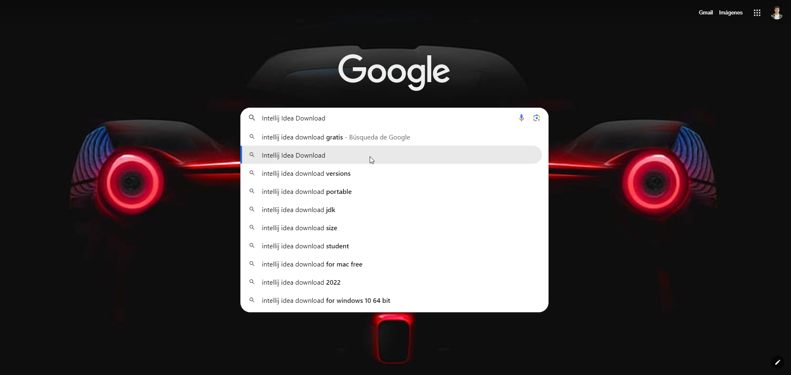
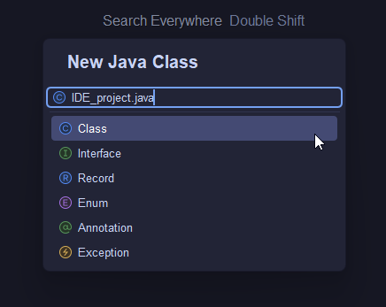
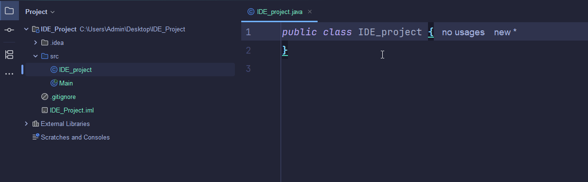
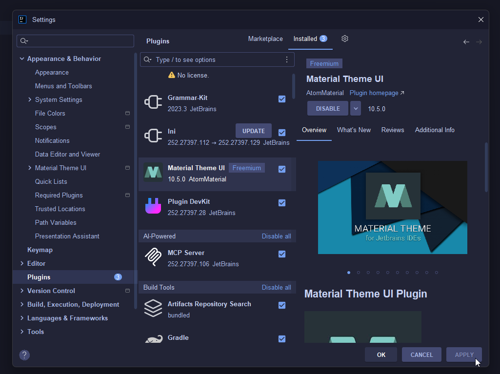
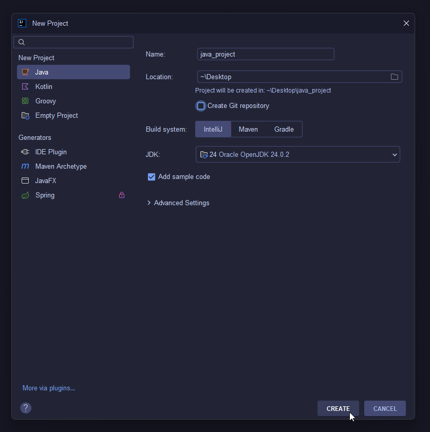
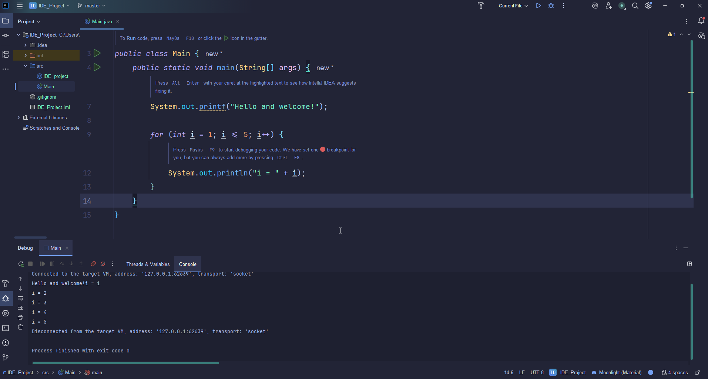

## IDE ⚙️

 

---

### ÍNDICE

---

 * Instalación
 * Creación de archivos
 * Funcionalidades avanzadas (Si las hubiera)
 * Creación de proyectos
 * Herramientas de debugging

 

> **IDE seleccionado:** Intellij IDEA

  

*¿Qué entendemos por **IDE**?* 
<b> Aplicación de software </b> que centraliza todas las <b> herramientas esenciales </b>
(*editor*, *traductor de código* y el *detector de errores*) para que los programadores
puedan **escribir**, **probar** y **construir** <b>software </b> de forma eficiente.

  

**1) Instalación**

- Vamos al motor de búsqueda. 

- Accedemos al siguiente enlace  

https://www.jetbrains.com/idea/  

- Clicamos en *Download*  

- Último clic en *Download*  

- Lo encontramos en local */descargas*  

  

---
  
**2) Creación de archivos**

Voy a generar un proyecto nuevo para ver de forma clara esa **creación de archivos**.
  

 Archivo *.java*   

> src (clic derecho) > *New* > *Java class* 

   

> Asignamos un nombre a nuestro archivo *.java*  

  

> ¡Archivo *.java* creado!  

  

---
  

**3) Funcionalidades avanzadas (*pluggins*)

Instalaremos por pasos una funcionalidad *o plugin* de fondo de nuestro *IDE*  

> File > Settings  

   

> Plugins > *Material Theme UI*  

   

> Apply  

  

---

  

**4) Creación de proyectos**

Volvemos a nuestro IDE de los dos puntos anteriores y generamos 
un proyecto. Será *Java project*

> File > *New* > *Project*  

  

> Desarrollamos un nombre y guardamos el proyecto en nuestra local. 
*Create*  

> ¡Proyecto *Java_project* creado!  

   

  

---

  

**5) Herramientas de debugging**  

Vamos a hacer que nuestro programa funcione. 

Antes nos posicionamos sobre el archivo que queramos arrancar.  
Comprobaremos tambien que el código está bien estructurado.
y va a funcionar.   

> *Run* > Debug *'nombreArchivo'*  

   

> En la parte inferior, vemos que la terminal muestra correctamente  
el código por pantalla.  

